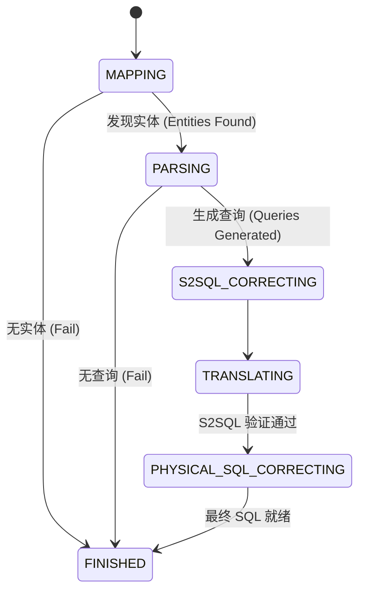

# Chat Parse 流程深度解析

本文档从技术层面详细剖析 Supersonic 的对话解析流水线（Pipeline），重点阐述 `ChatWorkflowEngine`、`SchemaMapper`、`SemanticParser` 以及 `SemanticCorrector` 之间的交互机制。

## 1. 架构概览

解析流程充当了 **Chat Layer**（有状态、面向用户）与 **Headless Layer**（无状态、语义理解）之间的桥梁。

*   **Chat Layer (对话层)**: 负责处理用户会话、历史记录管理以及多轮对话的改写（通过 `NL2SQLParser`）。
*   **Headless Layer (无头层)**: 由 `ChatWorkflowEngine` 编排，执行一个严格定义的状态机，将自然语言查询转化为经过验证的 SQL 语句。

## 2. 核心编排器：`ChatWorkflowEngine`

`S2ChatLayerService` 将繁重的处理逻辑委托给 `ChatWorkflowEngine`。该引擎实现了一个状态机模式，驱动查询上下文经历以下生命周期：



### 2.1 状态：MAPPING (实体识别)
*   **目标**: 识别用户 Query 中的 Schema 元素（指标、维度、值）。
*   **组件**: `SchemaMapper` (接口)。
*   **关键实现**:
    *   **`EmbeddingMapper`**:
        *   将查询文本转化为向量。
        *   在向量数据库中查询 Top-K 相似的 Schema 元素。
        *   **`EmbeddingMatchStrategy` (LLM 增强)**: 可选配置，利用 LLM 从向量召回的候选集中筛选出最相关的实体。
        *   输出: `SchemaElementMatch` (例如: "营收" -> Metric: `sales_revenue`, 相似度: 0.95)。
    *   **`KeywordMapper`** / **`TermMapper`**:
        *   执行基于字典的精确或模糊字符串匹配。

#### 核心 Prompts (Mapping)

**Embedding LLM Filter Prompt (`EmbeddingMatchStrategy`)**:
```text
#Role: You are a professional data analyst specializing in metrics and dimensions.
#Task: Given a user query and a list of retrieved metrics/dimensions through vector recall, please analyze which metrics/dimensions the user is most likely interested in.
#Rules:
1. Based on user query and retrieved info, accurately determine metrics/dimensions user truly cares about.
2. Do not return all retrieved info, only select those highly relevant to user query.
3. Maintain high quality output, exclude metrics/dimensions irrelevant to user intent.
4. Output must be in JSON array format, only include IDs from retrieved info, e.g.: ['id1', 'id2']
5. Return JSON content directly without markdown formatting
#Input Example:
#User Query: {{userText}}
#Retrieved Metrics/Dimensions: {{retrievedInfo}}
#Output:
```

### 2.2 状态：PARSING (意图理解)
*   **目标**: 将识别出的实体组合转化为 S2SQL (Supersonic Semantic SQL)。
*   **组件**: `SemanticParser` (接口)。
*   **关键实现**:
    *   **`RuleSqlParser` (基于规则)**:
        *   **触发条件**: 实体映射置信度高。
        *   **逻辑**: 检查匹配的实体是否符合预定义模板（例如："1个指标 + 1个时间范围"）。
        *   **动作**: `RuleSemanticQuery.resolve()` 直接构建 S2SQL（例如：`MATCH(revenue) QUERY`）。
    *   **`LLMSqlParser` (生成式)**:
        *   **触发条件**: 复杂查询或规则解析失败。
        *   **逻辑**:
            1.  **Context Builder**: 组装 `LLMReq`，包含用户 Query、匹配到的 Schema 元素（来自 MAPPING 阶段）以及 Few-shot 样本。
            2.  **Inference**: 通过 `LLMRequestService` 调用配置的大模型（GPT, DeepSeek 等）。
            3.  **Extraction**: 解析 LLM 的文本响应，提取 S2SQL 代码块。

#### 核心 Prompts (LLMSqlParser)

`LLMSqlParser` 通过 `OnePassSCSqlGenStrategy` 使用以下 Prompt 模板将自然语言转换为 SQL：

**Text-to-SQL Prompt (`S2SQL_PARSER`)**:
```text
#Role: You are a data analyst experienced in SQL languages.
#Task: You will be provided with a natural language question asked by users,please convert it to a SQL query so that relevant data could be returned by executing the SQL query against underlying database.
#Rules:
1.SQL columns and values must be mentioned in the `Schema`, DO NOT hallucinate.
2.ALWAYS specify time range using `>`,`<`,`>=`,`<=` operator.
3.DO NOT include time range in the where clause if not explicitly expressed in the `Question`.
4.DO NOT calculate date range using functions.
5.ALWAYS use `with` statement if nested aggregation is needed.
6.ALWAYS enclose alias declared by `AS` command in underscores.
7.Alias created by `AS` command must be in the same language ast the `Question`.
#Exemplars: {{exemplar}}
#Query: Question:{{question}},Schema:{{schema}},SideInfo:{{information}}
```
此 Prompt 强调了 Schema 的遵循、时间范围处理以及 S2SQL 的特定语法规则（如 `WITH` 子句和别名规范）。

#### 多轮对话改写 (Multi-turn Rewrite)
位于 `NL2SQLParser` 中，用于将包含代词（"它"）或省略上下文的查询改写为完整查询。

**Multi-turn Rewrite Prompt (`REWRITE_MULTI_TURN`)**:
```text
#Role: You are a data product manager experienced in data requirements.
#Task: Your will be provided with current and history questions asked by a user,along with their mapped schema elements(metric, dimension and value),please try understanding the semantics and rewrite a question.
#Rules: 
1.ALWAYS keep relevant entities, metrics, dimensions, values and date ranges.
2.ONLY respond with the rewritten question.
#Current Question: {{current_question}}
#Current Mapped Schema: {{current_schema}}
#History Question: {{history_question}}
#History Mapped Schema: {{history_schema}}
#History SQL: {{history_sql}}
#Rewritten Question: 
```

### 2.3 状态：S2SQL_CORRECTING (语义验证)
*   **目标**: 确保生成的 S2SQL 在语法上正确且在语义上一致。
*   **组件**: `SemanticCorrector` (接口)。
*   **实现**:
    *   **`GrammarCorrector`**: 修复 S2SQL 中的语法错误。
    *   **`SchemaCorrector`**: 验证 S2SQL 中使用的字段在当前 `DataSet` 中是否真实存在且可访问。
    *   **`LLMSqlCorrector`**: 利用 LLM 对 S2SQL 进行“二审”。

#### 核心 Prompts (SemanticCorrector)

**Semantic SQL Corrector Prompt (`S2SQL_CORRECTOR`)**:
```text
#Role: You are a senior data engineer experienced in writing SQL.
#Task: Your will be provided with a user question and the SQL written by a junior engineer,please take a review and help correct it if necessary.
#Rules: 
1.ALWAYS specify time range using `>`,`<`,`>=`,`<=` operator.
2.DO NOT calculate date range using functions.
3.SQL columns and values must be mentioned in the `#Schema`.
#Question:{{question}} #Schema:{{schema}} #InputSQL:{{sql}} #Response:
```
此步骤充当质量控制，特别是针对初级 LLM 可能产生的时间函数滥用或幻觉字段进行修正。

### 2.4 状态：TRANSLATING (编译器)
*   **目标**: 将 S2SQL（抽象层）编译为物理 SQL（特定方言，如 MySQL, ClickHouse）。
*   **组件**: `SemanticLayerService.translate()`。
*   **逻辑**:
    *   将 S2SQL 解析为 AST（抽象语法树）。
    *   应用优化规则（计算下推、Join 优化）。
    *   根据底层数据库方言生成最终的 SQL 字符串。

### 2.5 状态：PHYSICAL_SQL_CORRECTING (最终修缮)
*   **目标**: 修复物理 SQL 执行时的错误（较少见）或优化性能。
*   **组件**: `LLMPhysicalSqlCorrector`。
*   **逻辑**: 如果物理 SQL 执行失败（Dry-run），或需要性能优化。

#### 核心 Prompts (Physical Corrector)

**Physical SQL Corrector Prompt (`PHYSICAL_SQL_CORRECTOR`)**:
```text
#Role: You are a senior database performance optimization expert experienced in SQL tuning.

#Task: You will be provided with a user question and the corresponding physical SQL query, please analyze and optimize this SQL to improve query performance.

#Rules:
1. DO NOT add or introduce any new fields, columns, or aliases that are not in the original SQL.
2. Push WHERE conditions into JOIN ON clauses when possible to reduce intermediate result sets.
3. Optimize JOIN order by placing smaller tables or tables with selective conditions first.
...
#Question: {{question}}

#OriginalSQL: {{sql}}
```

## 3. 其他辅助功能 Prompts

Supersonic 除了核心解析流程外，还在周边功能中广泛使用 LLM。

### 3.1 结果解读 (Data Interpretation)
位于 `DataInterpretProcessor` 中，将结构化的查询结果转化为自然语言总结。

**Data Interpretation Prompt (`DATA_INTERPRETER`)**:
```text
#Role: You are a data expert who communicates with business users everyday.
#Task: Your will be provided with a question asked by a user and the relevant result data queried from the databases, please interpret the data and organize a brief answer.
#Rules: 
1.ALWAYS respond in the use the same language as the `#Question`.
2.ALWAYS reference some key data in the `#Answer`.
#Question:{{question}} #Data:{{data}} #Answer:
```

### 3.2 错误信息改写 (Error Rewrite)
位于 `ErrorMsgRewriteProcessor` 中，将晦涩的系统报错转化为友好提示。

**Error Rewrite Prompt (`REWRITE_ERROR_MESSAGE`)**:
```text
#Role: You are a data business partner who closely interacts with business people.
#Task: Your will be provided with user input, system output and some examples, please respond shortly to teach user how to ask the right question, by using `Examples` as references.
#Rules: ALWAYS respond with the same language as the `Input`.
#Input: {{user_question}}
#Output: {{system_message}}
#Examples: {{examples}}
#Response:
```

### 3.3 记忆评估 (Memory Review)
位于 `MemoryReviewTask` 中，定期评估存储的历史问答对是否值得保留。

**Memory Review Prompt (`MEMORY_REVIEW`)**:
```text
#Role: You are a senior data engineer experienced in writing SQL.
#Task: Your will be provided with a user question and the SQL written by a junior engineer,please take a review and give your opinion.
#Rules: 
1.ALWAYS follow the output format: `opinion=(POSITIVE|NEGATIVE),comment=(your comment)`.
2.NO NEED to check date filters as the junior engineer seldom makes mistakes in this regard.
#Question: %s #Schema: %s #SideInfo: %s #SQL: %s
#Response: 
```

### 3.4 别名生成 (Alias Generation)
位于 `AliasGenerateHelper` 中，用于自动为指标、维度或值生成同义词，增强匹配能力。

**Name Alias Prompt**:
```text
#Role: You are a professional data analyst specializing in metrics and dimensions.
#Task: You will be provided with metadata about a metric or dimension, please help generate a few aliases in the same language as its `fieldName`.
#Rules:
1. Please do not generate aliases like xxx1, xxx2, xxx3.
...
#Metadata: {'table':'{{table}}', 'name':'{{name}}', 'type':'{{type}}', 'field':'field', 'description':'{{desc}}'}
#Output:
```

**Value Alias Prompt**:
```text
#Role: You are a professional data analyst.
#Task: You will be provided with a json array of dimension values,please help generate a few aliases for each value.
#Rule:
1. ALWAYS output json array for each value.
2. The aliases should be in the same language as its original value.
...
Values: {{values}}, Output:
```

### 3.5 语义建模 (Semantic Modeling)
位于 `LLMSemanticModeller` 中，根据数据库 Schema 自动构建语义模型。

**Model Build Prompt (`BUILD_DATA_MODEL`)**:
```text
Role: As an experienced data analyst with extensive modeling experience, you are expected to have a deep understanding of data analysis and data modeling concepts.
Job: You will be given a database table structure... Your task is to utilize this information for data modeling.
Task:
1. Generate a name and description for the model...
2. Create a Chinese name for the field and categorize the field...
...
DBSchema: {{DBSchema}}
OtherRelatedDBSchema: {{otherRelatedDBSchema}}
Exemplar: {{exemplar}}
```

### 3.6 闲聊 (Small Talk)
位于 `PlainTextExecutor` 中，处理非数据查询类的闲聊。

**Small Talk Prompt (`SMALL_TALK`)**:
```text
#Role: You are a nice person to talk to.
#Task: Respond quickly and nicely to the user.
#Rules: 1.ALWAYS use the same language as the `#Current Input`.
#History Inputs: %s
#Current Input: %s
#Response: 
```

## 4. 关键类源码映射

| 组件 | 类名 | 路径 |
| :--- | :--- | :--- |
| **Engine** | `ChatWorkflowEngine` | `headless/server/.../utils/ChatWorkflowEngine.java` |
| **Service** | `S2ChatLayerService` | `headless/server/.../service/impl/S2ChatLayerService.java` |
| **Mapper** | `EmbeddingMapper` | `headless/chat/.../mapper/EmbeddingMapper.java` |
| **Mapper Strategy** | `EmbeddingMatchStrategy` | `headless/chat/.../mapper/EmbeddingMatchStrategy.java` |
| **Parser** | `RuleSqlParser` | `headless/chat/.../parser/rule/RuleSqlParser.java` |
| **Parser** | `LLMSqlParser` | `headless/chat/.../parser/llm/LLMSqlParser.java` |
| **Corrector** | `LLMSqlCorrector` | `headless/chat/.../corrector/LLMSqlCorrector.java` |
| **Interpreter** | `DataInterpretProcessor` | `chat/server/.../processor/execute/DataInterpretProcessor.java` |
| **Modeller** | `LLMSemanticModeller` | `headless/server/.../modeller/LLMSemanticModeller.java` |
