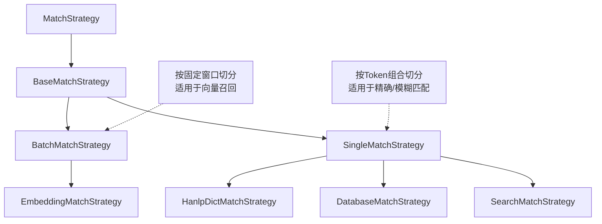

# Supersonic Schema MatchStrategy 深度解析

`MatchStrategy` 是 Supersonic 在 **MAPPING (实体识别)** 阶段的核心接口，负责将自然语言 Query 映射到底层的 Schema 元素（指标、维度、值等）。

由于自然语言的多样性，单一的匹配逻辑无法满足需求。Supersonic 采用了 **策略模式 (Strategy Pattern)**，设计了多层级的匹配策略体系。

## 1. 核心接口与抽象层

### 1.1 `MatchStrategy` (Interface)
所有匹配逻辑的顶层接口。
```java
public interface MatchStrategy<T extends MapResult> {
    Map<MatchText, List<T>> match(ChatQueryContext chatQueryContext, List<S2Term> terms, Set<Long> detectDataSetIds);
}
```
*   **输入**:
    *   `ChatQueryContext`: 包含用户 Query、Schema 上下文等。
    *   `List<S2Term>`: 分词后的 Token 列表（由 HanLP 等分词器生成）。
    *   `Set<Long> detectDataSetIds`: 目标数据集 ID 集合。
*   **输出**: `Map<MatchText, List<T>>`，即“文本片段”到“匹配结果”的映射。

### 1.2 `BaseMatchStrategy` (Abstract Class)
提供通用的异步执行框架。
*   **`executeTasks`**: 核心方法。它接收一组 `Supplier<List<T>>` 任务，使用 `ThreadPoolExecutor` 并行执行，并对结果进行合并与去重 (`selectResultInOneRound`)。这保证了在进行大规模字典匹配或向量搜索时的高性能。
*   **`selectResultInOneRound`**: 去重逻辑。如果发现重复的匹配结果（针对同一实体的多次匹配），会保留相似度（Similarity）更高的那个。

## 2. 两大派系：切分策略

为了处理长难句，Supersonic 衍生出了两种截然不同的文本切分策略：

### 2.1 `BatchMatchStrategy` (基于滑动窗口)
*   **逻辑**: 无视语义，简单粗暴地按固定长度（`EMBEDDING_MAPPER_TEXT_SIZE`）和步长（`EMBEDDING_MAPPER_TEXT_STEP`）对 Query 进行滑动窗口切分。
*   **适用场景**: **向量搜索 (Embedding)**。因为 Embedding 模型通常对输入长度有限制，且更关注片段的整体语义，而不是精确的词法边界。
*   **核心实现**:
    *   **`EmbeddingMatchStrategy`**: 
        *   将切分后的片段转化为向量。
        *   调用 `MetaEmbeddingService` 进行向量相似度检索。
        *   **LLM 增强**: 支持使用 LLM (`LLM_FILTER_PROMPT`) 对向量召回的候选集进行二次筛选，剔除不相关结果。

### 2.2 `SingleMatchStrategy` (基于 Token)
*   **逻辑**: 尊重语义，基于分词结果（`S2Term`）进行组合切分。它会尝试不同的 Token 组合（N-Gram）作为探测片段。
*   **适用场景**: **精确匹配 / 模糊匹配**。适用于数据库 LIKE 查询、字典查找等需要精确对齐词汇的场景。
*   **核心实现**:
    *   **`HanlpDictMatchStrategy`** (推测): 基于 HanLP 分词和内部字典的匹配。
    *   **`DatabaseMatchStrategy`** (推测): 直接去数据库进行 `LIKE` 查询（通常用于维度值的匹配，如“上海”）。
    *   **`SearchMatchStrategy`** (推测): 可能涉及搜索引擎（如 Elasticsearch）的倒排索引匹配。

## 3. 策略协作图谱



## 4. 关键配置参数 (`MapperConfig`)

*   `s2.mapper.embedding.text.size`: 向量匹配的窗口大小。
*   `s2.mapper.embedding.text.step`: 向量匹配的滑动步长。
*   `s2.mapper.embedding.use-llm-enhance`: 是否开启 Embedding 后的 LLM 过滤（默认 false）。
*   `s2.mapper.embedding.threshold`: 向量相似度阈值。

## 5. 总结

Supersonic 的 `MatchStrategy` 设计精妙地平衡了**召回率 (Recall)** 和 **性能 (Performance)**：

1.  **分治**: 通过 `Single` 和 `Batch` 两种策略，分别应对“精确词汇匹配”和“语义模糊匹配”。
2.  **并行**: 利用 `BaseMatchStrategy` 的异步框架，并行执行多种探测任务，降低延迟。
3.  **智能**: 引入 Embedding 和 LLM，解决了传统基于规则或字典匹配的僵化问题，提高了对自然语言的理解能力。
